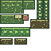

# Wild Terrain

Wild Terrain is a Forge 1.20.1 mod framework for exploration-first creatures, terrain, ecology, and ruins. The first playable slice adds the Mossquill, a moss-backed creature that fits lush caves, swamps, jungles, and overgrown ruins.

## Playable Slice

Mossquills are peaceful ruin-grazers. They can be bred with moss blocks or moss carpet, are tempted by glow berries, and reward players who feed them glow berries with a short regeneration and haste buff. When mob griefing is enabled, they slowly weather cobblestone and stone bricks into mossy variants, giving ruins a living ecological loop.

The attached texture is generated from `tools/generate_mossquill_assets.py`, which also creates the Mossquill Field Guide icon. This keeps the current pixel-art assets reproducible until the creature graduates to hand-authored Blockbench/Aseprite production art.

The current polish slice adds:

- A refined Java model with separate ears, muzzle, moss blanket, tail tuft, paws, and animated quill rows.
- Synced animation states for grazing/mossing, glow-berry delight, random sniffing, idle breathing, walking, ear flicks, and tail motion.
- A Mossquill Field Guide item with a custom in-game UI that documents habitat, behavior, ecology, and animation tells.

## Creature Designs

These designs are the north star for the mod: each creature should touch at least two systems, such as behavior plus ecology, worldgen plus ruins, or player utility plus risk.

| Creature | Status | Habitat | Core Design |
| --- | --- | --- | --- |
| Mossquill / 苔针兽 | Implemented | Lush caves, swamps, jungles, overgrown ruins | Peaceful ruin-grazer that mosses old stone, breeds on moss, and trades glow berries for short restoration buffs. |
| Lanternback Nacrelisk / 灯背珠蜥 | Designed | Abyssal cave pools, dripstone aquifers | Slow amphibian with a living lantern shell. It scares small hostile mobs, attracts fish, and reveals nearby underwater ruin glyphs when fed prismarine shards. |
| Silt Skater / 泥纹掠行者 | Designed | Mangrove swamps, river deltas, mud flats | Insectile surface-skimmer that rides water and mud. Its wake briefly firms mud into walkable silt paths, making swamp traversal a creature-driven mechanic. |
| Basalt Bellwether / 玄武鸣羊 | Designed | Basalt deltas, volcanic caves | Herd animal with resonant horns. Herd calls expose hidden ore veins and unstable basalt bridges, but loud calls can also wake deeper predators. |
| Archive Wisp / 遗卷灵火 | Designed | Underground cabins, libraries, ruins | Curious spirit that replays fragments of lost structures. Following it can reveal loot rooms, but angering it scrambles maps and compass bearings. |
| Canopy Kite / 林冠风筝兽 | Designed | Jungles, tall forests, cliff canopies | Gliding omnivore that seeds rare canopy plants. Tamed trust should be temporary and food-based rather than permanent pet ownership. |

Full creature briefs live in [docs/CREATURE_DESIGNS.md](docs/CREATURE_DESIGNS.md).

## Dev Platform

- `./gradlew runClient` launches a real Forge dev client with the mod loaded.
- `./gradlew runServer` launches a dedicated test server.
- `./gradlew build` creates the reobfuscated mod jar in `build/libs`.
- `./gradlew installClientMod` builds and copies the jar into `~/Library/Application Support/minecraft/mods`.
- `python3 tools/generate_mossquill_assets.py` regenerates the current Mossquill pixel textures.

Minecraft Java mods cannot load in a truly vanilla client; this project targets your local Forge 1.20.1 install so the final jar can be tested in real Minecraft. Citadel is listed as an optional compatibility dependency because Alex's Mobs and Alex's Caves use it, but this first creature has no hard runtime library dependency beyond Forge.

## Expansion Points

- Add more creatures under `dev.lukez.wildterrain.common.entity`.
- Add terrain and ecology placement with data-driven biome modifiers under `src/main/resources/data/wildterrain`.
- Add ruin structures through worldgen JSON/template pools as the next slice.
- Start each agent task by reading [AGENTS.md](AGENTS.md), [docs/BEST_PRACTICES.md](docs/BEST_PRACTICES.md), and [docs/PROGRESS.md](docs/PROGRESS.md).
- Follow the repeatable creature workflow in [docs/CREATURE_PIPELINE.md](docs/CREATURE_PIPELINE.md).
